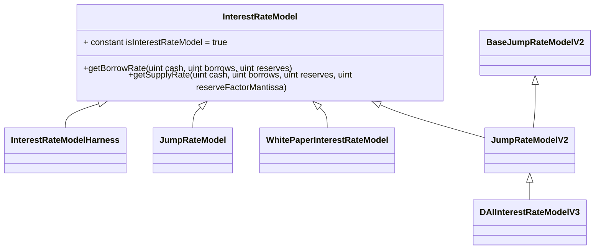
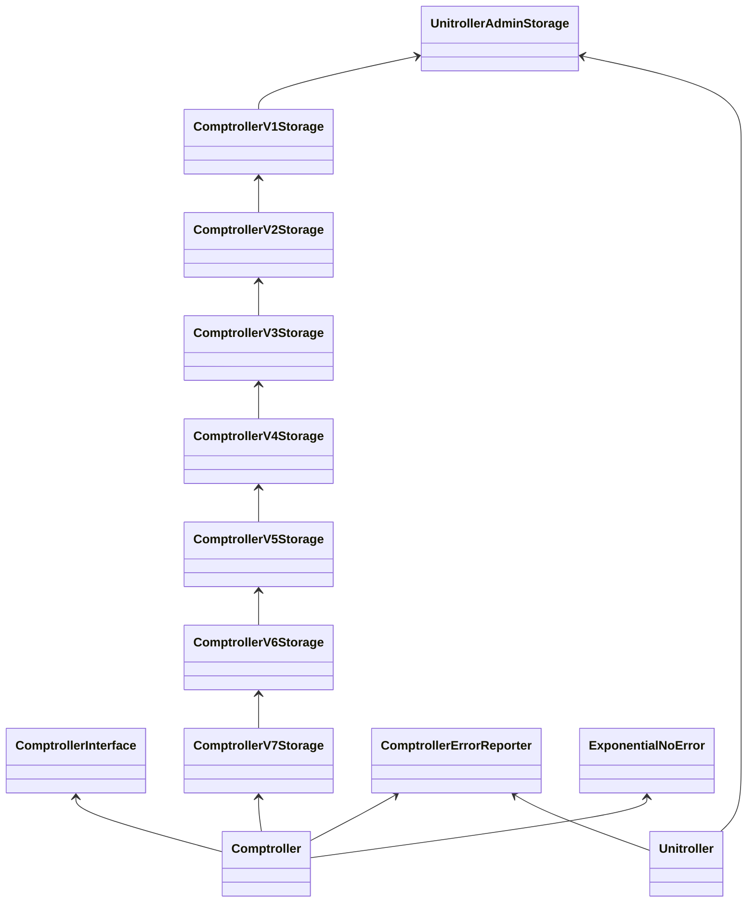
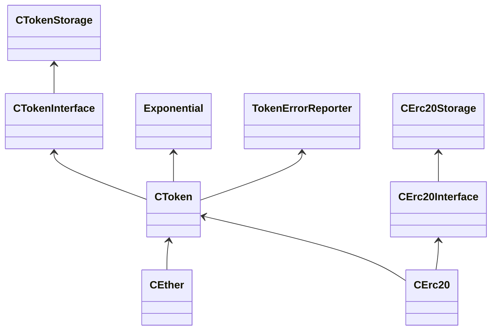

# 借贷

$$
Supply Interest Rate_a = Borrowing Interest Rate_a * U_a
$$

### 借贷

#### Compound

超额抵押，以USDC为例，抵押率为80%，假如1ETH=3000USDC，则抵押1ETH能借出2400USDC

流动性来源：用户存钱

资金池风险：挤兑

防止挤兑

* 资金池储备金（利息积累的一部分）
* 调正存贷利率

如何计算存款利率

存款利率 = 贷款利率 \* 资金利用率

资金利用率是针对一个资金池的，不是针对用户

**cToken**

用户存款后会得到cToken，作为存款凭证（生息代币），每种标的资产对于一种cToken，如：ETH - cETH，DAI - cDAI

Token - cToken兑换率：exchange = (totalCash + totalBorrows - totalReserves) / totalSupply

归还时，归还cToken，返回token，包括本金 + 利息，cToken会被销毁

**利率模型**

**直线型**

计算公式：

$$
y = k \cdot x + b
$$


```solidity
constructor(uint baseRatePerYear, uint multiplierPerYear) public {
	baseRatePerBlock = baseRatePerYear / blocksPerYear;
	multiplierPerBlock = multiplierPerYear / blocksPerYear;

	emit NewInterestParams(baseRatePerBlock, multiplierPerBlock);
}
```

* **baseRatePerYear**：基准年利率，公式中的 b
* **multiplierPerYear**：斜率 k 值

**资金利用率**：

```solidity
function utilizationRate(uint cash, uint borrows, uint reserves) public pure returns (uint) {
	// Utilization rate is 0 when there are no borrows
	if (borrows == 0) {
		return 0;
	}
	return borrows * BASE / (cash + borrows - reserves);
}
```

$$
U_a=\frac{Borrows_a（总借款）}{(Cash_a（资金池余额）+Borrows_a（总借款）-reserves（储备金）)}
$$

**借款利率**：

```solidity
function getBorrowRate(uint cash, uint borrows, uint reserves) override public view returns (uint) {
	uint ur = utilizationRate(cash, borrows, reserves);
	return (ur * multiplierPerBlock / BASE) + baseRatePerBlock;
}
```

$$
Borrowing Interest Ratea = U_a \cdot k + b
$$

**存款利率**：

```solidity
function getSupplyRate(uint cash, uint borrows, uint reserves, uint reserveFactorMantissa) override public view returns (uint) {
        uint oneMinusReserveFactor = BASE - reserveFactorMantissa;
        uint borrowRate = getBorrowRate(cash, borrows, reserves);
        uint rateToPool = borrowRate * oneMinusReserveFactor / BASE;
        return utilizationRate(cash, borrows, reserves) * rateToPool / BASE;
}
```

$$
Supply Interest Rate_a = U_a \cdot Borrowing Interest Ratea \cdot (1 - reserveFactorMantissa（储备金率）)
$$

$$
资金利用率 = x
$$

$$
贷款利率 = y = 0.025 + 0.2 \cdot x
$$

$$
存款利率 = z = 0.025 \cdot x + 0.2x \cdot x
$$

**拐点型**

当资金利用率小于`klink`（应用跳跃乘数的利用点），利率公式和直线型的一样

而超过拐点之后，则利率公式将变成：

$$
y = k2 \cdot (x - p) + (k \cdot p + b)
$$

```solidity
function getBorrowRateInternal(uint cash, uint borrows, uint reserves) internal view returns (uint) {
        uint util = utilizationRate(cash, borrows, reserves);
        if (util <= kink) {
            return ((util * multiplierPerBlock) / BASE) + baseRatePerBlock;
        } else {
            uint normalRate = ((kink * multiplierPerBlock) / BASE) + baseRatePerBlock;
            uint excessUtil = util - kink;
            return ((excessUtil * jumpMultiplierPerBlock) / BASE) + normalRate;
      }
}
```

**借款利率**：

$$
Borrowing Interest Ratea = (U_a - klink) \cdot ( + 0.25) + klink \cdot 0.2;
$$

**代码模块**

**InterestRateModel**

利率模型的抽象合约



**Comptroller**

入口合约为 Unitroller，是一个代理合约。



**CToken**


