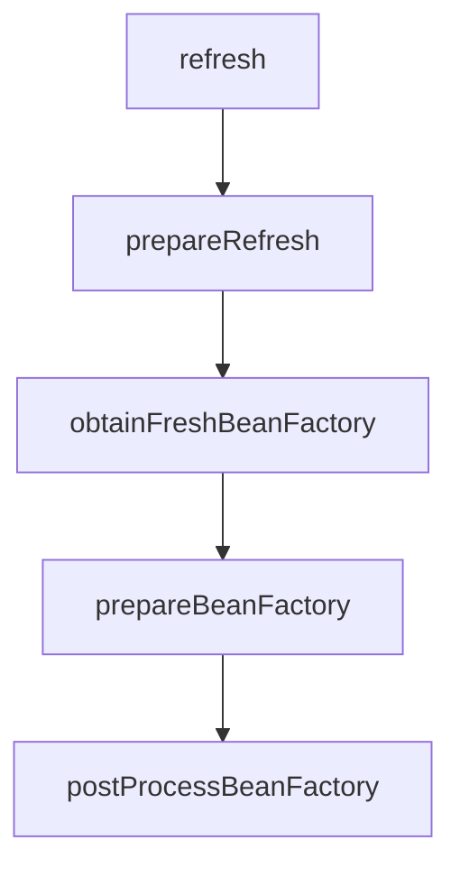
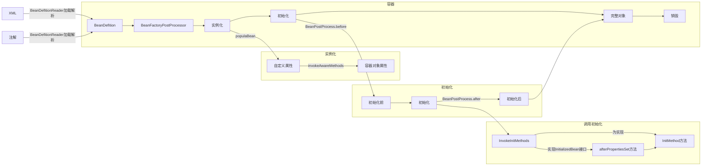

# Spring

### IOC(控制反转)

将`new`对象的动作交给**Spring**进行管理

### AOP

1.  **切面（Aspect）**：面向规则，具有相同规则的方法的集合体。

    在Spring AOP中，切面可以在类上使用`@AspectJ`注解来实现。
2. **连接点（Join point）**：指程序运行过程中所执行的方法。在Spring AOP中，一个连接点总代表一个方法的执行。
3. **切点（Pointcut）**：需要代理的具体方法。
4. **通知（Advice）**：回调。
   1. 前置通知（Before Advice）在invoke Pointcut之前调用，织入的方法
   2. 后置通知（After Advice）在Pointcut之后调用，织入的方法
   3. 返回后通知（After Return Advice）返回值为Void，织入的方法
   4. 环绕通知（Around Advice）只要触发调用，织入的方法
   5. 异常通知（After Throwing Advice）Pointcut抛出异常，织入的方法
5. **目标对象（Target Object）**：被代理的对象
6. **织入（Weaving）**：通过动态代理，在目标对象（Target）的方法（即连接点Join point）中执行增强逻辑（Advice）的过程。


### 启动流程

#### Refresh

1.  prepareRefresh()

    刷新上下文环境，对系统的环境变量或者系统属性进行准备和校验
2.  obtainFreshBeanFactory()

    获取在容器初始化时创建的BeanFactory；
3.  prepareBeanFactory(beanFactory)：

    BeanFactory的预处理工作，向容器中添加一些组件，如：`ApplicationContextAwareProcessor`等
4.  postProcessBeanFactory(beanFactory)

    子类重写该方法，可以实现在BeanFactory创建并预处理完成以后做进一步的设置；
5.  invokeBeanFactoryPostProcessors(beanFactory)

    在BeanFactory标准初始化之后执行BeanFactoryPostProcessor的方法，即BeanFactory的后置处理器：

    先执行实现`PriorityOrdered`接口的BeanDefinitionRegistryPostProcessor，如：`ConfigurationClassPostProcessor`

    1. `getBeanFactoryPostProcessors()`获取Spring容器已注册的`BeanFactoryPostProcessor`，默认拿不到
    2. `ConfigurationClassPostProcessor.postProcessBeanFactory(ConfigurableListableBeanFactory beanFactory)`
       1.  `parser.parse(candidates);`

           解析，扫描注解等操作

           1. `@Component` Recursively process any member (nested) classes first
           2. Process any @PropertySource annotations
           3. Process any @ComponentScan annotations
           4. Process any @Import annotations
              1. 如果实现`DeferredImportSelector`
              2. 进行`process()`处理
              3. 进行`selectImports()`处理
           5. Process any @ImportResource annotations
           6. rocess individual @Bean methods
       2. 加载`BeanDefinition`信息添加至`DefaultListableBeanFactory`
6. registerBeanPostProcessors(beanFactory)：向容器中注册Bean的后置处理器BeanPostProcessor，它的主要作用是干预Spring初始化bean的流程，从而完成代理、自动注入、循环依赖等功能
7. initMessageSource()：初始化MessageSource组件，主要用于做国际化功能，消息绑定与消息解析：
8. initApplicationEventMulticaster()：初始化事件发布器，在注册监听器时会用到：
9. onRefresh()：留给子容器、子类重写这个方法，在容器刷新的时候可以自定义逻辑，Spring Boot中Tomcat在此过程完成创建启动。
10. registerListeners()：注册监听器：将容器中所有的ApplicationListener注册到事件派发器中，并派发之前步骤产生的事件：
11. finishBeanFactoryInitialization(beanFactory)：初始化所有剩下的单实例bean，核心方法是preInstantiateSingletons()，会调用getBean()方法创建对象；
    1. 对象实例化
    2.  扫描Bean中是否添加`@Autowired`、`@Value`、`@Resource`

        ```java
        applyMergedBeanDefinitionPostProcessors(mbd, beanType, beanName);
        ```

        * `AutowiredAnnotationBeanPostProcessor`：会扫描Bean的类中是否使用了`@Autowired`和`@Value`注解，后续根据缓存信息进行属性填充；
        * `CommonAnnotationBeanPostProcessor`：会扫描Bean类中是否使用了`@Resource`等注解，同样缓存起来等待后续进行属性填充。
    3. `populateBean()`依赖注入
    4. `BeanPostProcess`前置处理
    5. `BeanPostProcess`后置处理
12. finishRefresh()：发布BeanFactory容器刷新完成事件。
    1. `initLifecycleProcessor()`初始化声明周期处理器
    2. `getLifecycleProcessor().onRefresh()`，刷新生命周期处理器，`smartLifecycle.start()`在此执行

### 事件机制

Spring事件监听由三个部分组成

*   ApplicationEvent（事件）

    负责对应监听器，事件源发生某件事件是特定事件监听器被触发的原因
*   ApplicationListener（监听器）

    对应观察者中的观察者。监听器监听特定事件，并发内部定义了事件发生后的响应逻辑
*   ApplicationMulticaster（事件发布器）

    对应观察者模式中的被观察者/主题，负责通知观察者对外提供发布事件和增删事件监听器的接口，维护事件和监听器之间的映射关系，并在事件发生时负责通知相关监听器。

### 注解

#### 配置

* `@Configuration`：把一个类作为一个IOC容器，它的某个方法上加了`@Bean`，就会作为这个Spring容器的Bean。
  * `@CommponentScan`：在配置类上添加，默认扫描该类所在包下的所有`@Compoent`、`@Service`、`@Controller`注解被扫描加入IOC
* `@Scope`：指定作用域
  * `prototype`：多例
  * `singleton`：单例，默认
  * `request`：主要应用于web模块，一次请求创建一个实例
  * `session`：主要应用于web模块，同一个session只创建一个实例
* ### `@Lazy`：延迟加载
* `@Conditional`：满足一定条件注入Spring容器
* `@Import`：导入外部资源，实现Bean的动态装载

#### 生命周期

**对象创建后**

* 实现`InitializingBean`
* `@PostConstruct`

**对象销毁后**

* 实现`DisposableBean`
* `@PreDestroy`

#### 包扫描

`@CompoendScan`

*   basePackages

    指定扫描路径，如果为空以`@CompoendScan`注解所在目录作为扫描路径
*   basePackageClasses

    制定具体扫描的类
*   includeFilters

    指定满足`Filter`条件的类
*   excludeFilters

    指定排除`Filter`条件的类

#### 自动装配

* `@Component`
* `@Service`
* `@Controller`
* `@Repository`
* `@Value`
* `@Bean`
  * **autoWire = AutoWire.ByType**：找set()方法参数的类型从IOC中获取
  * **autoWire = AutoWire.ByName**：找set方法后面的名称
  * **autowireCandidate = false**：当前注册的Bean不能赋值给其他B
* `@AutoWired`：按照类型进行装配，
* `@PropertySource`：读取配置文件赋值
* `@Qualifier`：按名称进行装配，存在多个Bean时使用
* `@Primary`：自动装配出现多个Bean时，注解为`@Primary`的Bean作为首选者
* `@Resource`：按照名称进行装配，找不到时再按照类型

#### 加载资源

*   @PropertySource("classpath:xxx.properties")

    用于指定的配置文件
*   @ConfigurationProperties(prefix="")

    用于主配置文件

#### 注解名称

* `ApplicationContextAware`：可以通过这个上下文环境得到Spring容器中的Bean
* `BeanDefinitionRegistryPostProcessor`：实现了`BeanFactoryPostProcessor`接口，是Spring框架的`BeanefinitionRegistry`的后处理器，用来注册额外的`BeanDefinition`

#### AOP

**@Before（前置通知）**

目标方法执行之前

**@After（后置通知）**

目标方法之后执行

**@AfterReturning（返回之后通知）**

执行方法结束之前执行（异常不执行）

**@AfterThrowing（异常通知）**

出现异常后执行

**@Around（环绕通知）**

环绕目标方法执行

### 核心组成

#### Environment(环境信息)

**StandardEnvironment**

#### BeanDefinitionReader（Bean信息读取）

#### ImportBeanDefinitionRegistrar

和`@Import`结合使用，可以注册`BeanDefiniton`，在`CongurationClassPostProcessor.parse()`处理`@Confuration`调用。

#### ClassPathBeanDefinitionScanner（扫描BeanDefinition）

* **Mybatis**中`ClassPathMapperScanner extends ClassPathBeanDefinitionScanner`完成对Mapper的`BeanDefinition`扫描

#### BeanDefinition(描述对象的元信息)

#### BeanFactoryPostProcessor(对BeanDefinition做扩展)

#### BeanDefinitionRegistryPostProcessor

继承`BeanFactoryPostProcessor`，`postProcessBeanDefinitionRegistry`可以自定义`BeanDefinition`注册，优于`postProcessBeanFactory`执行。

#### (访问Spring Bean容器的根接口)

`BeanFactory`的默认实现

```java
class DefaultListableBeanFactory{
    //bean 定义对象的映射，以 bean 名称为键
    private final Map<String, BeanDefinition> beanDefinitionMap = new ConcurrentHashMap<>(256);
    //bean 定义名称列表，按注册顺序排列
	private volatile List<String> beanDefinitionNames = new ArrayList<>(256);
}
```

**DefaultListableBeanFactory(BeanFactory的默认实现)**

#### BeanPostProcessor(对象初始化前后执行)

**AutowiredAnnotationBeanPostProcessor**

针对`@Autowired`

**CommonAnnotationBeanPostProcessor**

针对`@Resource`、`@PostConstruct`、`@PreDestroy`

#### 流程



**obtainFreshBeanFactory**




### 源码

#### AOP

```mermaid
sequenceDiagram
participant Actor
Actor ->> AbstractAutoProxyCreator:postProcessBeforeInstantiation()调用createProxy()
AbstractAutoProxyCreator -->> ProxyFactory: create()
ProxyFactory -->> AbstractAutoProxyCreator: 
AbstractAutoProxyCreator -->> ProxyFactory: getProxy()
ProxyFactory ->> AopProxy: getProxy()
AopProxy -->> ProxyFactory: 
ProxyFactory -->> AbstractAutoProxyCreator:  
```

### 常用工具类

#### 国际化（MessageSource）

实现MessageResourceAware

#### 资源加载

```java
context.getResource();//读取文件资源、网络资源
```

#### 获取运行时环境

```java
context.getEnvironment();//操作系统环境变量、JVM环境变量
```

#### 事件发布

* ApplicationListener（某个类事件监听器）
* EventListener（某个方法事件监听器）

#### Order比较器

* OrderComparatoer（利用Order接口来指定顺序）
* AnnotationAwareOrderComparator（利用@Order注解来指定顺序）

#### 注解工具类

AnnotationUtils

#### 反射工具类

ReflectUtils
